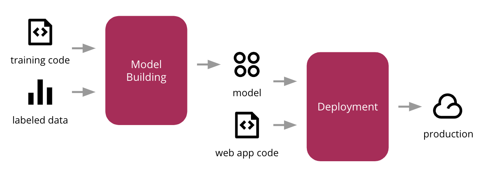
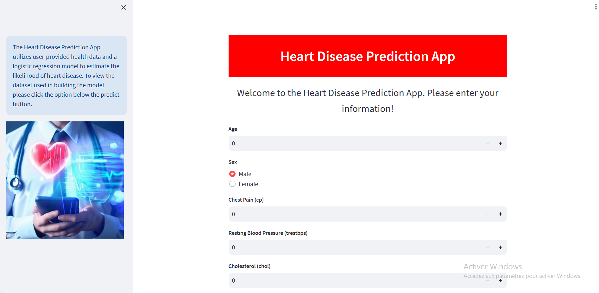
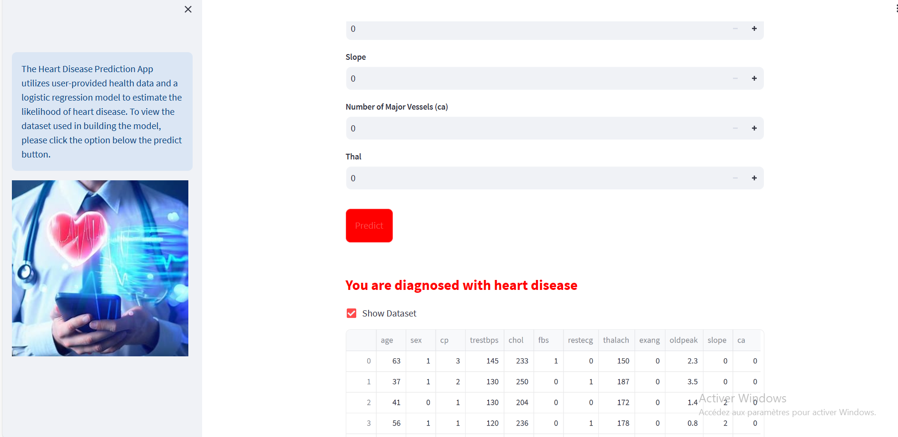

# Develop and Deploy A Heart Diseace Prediction App using Python, Streamlit and Docker


## Prerequisite:

- An IDE/ Text Editor 
- Python 3.10+ 
- PIP (or Anaconda)
- Docker Desktop

## Executing the Script

```
 python310 src/app.py
```

## Viewing Your Streamlit App

```
You can now view your Streamlit app in your browser.

  Local URL: http://localhost:8501
  Network URL: http://192.168.1.132:8501
 ```





## App Overview

<br>


